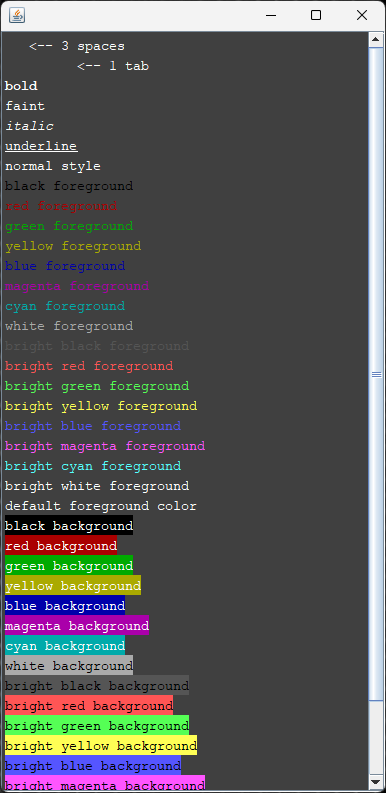

# ANSI Support in Java Swing with Java classes

Note that you can also find Kotlin classes as a supplement to the Java classes [here](../kotlin/README.md).

## Provided classes

These classes are provided:

- [AnsiEditorKit]
- [AnsiTextBuilder]
- [AnsiEscCode]
- [DefaultAnsiColors]
- [AnsiEditorPane]
- [AnsiDemoFrame]

## AnsiEditorKit

The [AnsiEditorKit] is a [StyledEditorKit] where you can insert text containing ANSI escape codes using a `insertAnsi()`
method, which inserts plain text into a [StyledDocument] with styling and coloring attributes based on the ANSI escape
codes.

## AnsiTextBuilder

The [AnsiTextBuilder] is useful for creating ANSI text without the need of knowing the ANSI escape codes.
The builder uses a [Fluent Interface] for building the text.

Example of how to use the AnsiTextBuilder:

```java
var ansiTextBuilder = AnsiTextBuilder()
    .bold().red().text("bold").newline();

var ansiText = ansiTextBuilder.build();
```

## AnsiEscCode

The [AnsiEscCode] is an enum class that encapsulates supported ANSI Escape Codes.

You can get the escape code using the `escCode` property like in this example:

```java
var escCode = AnsiEscCode.BOLD.escCode; // ␛[1m
```

## DefaultAnsiColors

The [DefaultAnsiColors] is provided to provide some default colors to be used for the [AnsiEditorKit].
It extends the [IAnsiColors] interface that allows you to provide multiple different color schemes to be used by the
[AnsiEditorKit].

You can provide your own [IAnsiColors] implementation to the primary constructor of the [AnsiEditorKit]:

```java
public AnsiEditorKit(int fontSize, IAnsiColors ansiColors) {
    this.fontSize = fontSize;
    this.ansiColors = ansiColors;
}
```

Note that you can also set the font size of the monospaced font set, if you want to change it from the default size.

## AnsiEditorPane

The [AnsiEditorPane] is provided for demo purposes. Basically, it sets up the [AnsiEditorKit] and creates
a [StyledDocument] for it as well supporting ANSI Escape Codes.

```java
public AnsiEditorPane() {
    EditorKit ansiKit = new AnsiEditorKit();
    setEditorKit(ansiKit);
    setDocument(ansiKit.createDefaultDocument());
}
```

## AnsiDemoFrame

The [AnsiDemoFrame] is provided for demo purposes that puts all parts together by using a [AnsiEditorPane] and
[AnsiTextBuilder]. Internally, the [AnsiEditorPane] uses a [AnsiEditorKit].

This is screenshot of the AnsiDemoFrame:




[AnsiEditorKit]: /src/main/java/java_swing_ansi_support/AnsiEditorKit.java

[AnsiTextBuilder]: /src/main/java/java_swing_ansi_support/AnsiTextBuilder.java

[AnsiEscCode]: /src/main/java/java_swing_ansi_support/AnsiEscCode.java

[DefaultAnsiColors]: /src/main/java/java_swing_ansi_support/DefaultAnsiColors.java

[IAnsiColors]: /src/main/java/java_swing_ansi_support/IAnsiColors.java

[AnsiEditorPane]: /src/main/java/java_swing_ansi_support/DefaultAnsiColors.java

[AnsiDemoFrame]: /src/main/java/java_swing_ansi_support/AnsiDemoFrame.java

[StyledEditorKit]: https://docs.oracle.com/en/java/javase/21/docs/api/java.desktop/javax/swing/text/StyledEditorKit.html

[StyledDocument]: https://docs.oracle.com/en/java/javase/21/docs/api/java.desktop/javax/swing/text/StyledDocument.html

[Fluent Interface]: https://java-design-patterns.com/patterns/fluentinterface/