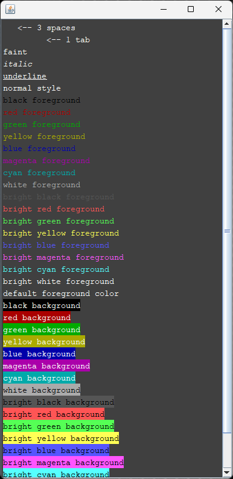

# ANSI Support in Java Swing with Kotlin classes

## Provided classes

These classes are provided:

- [AnsiEditorKit]
- [AnsiTextBuilder]
- [AnsiEscCode]
- [DefaultAnsiColors]
- [AnsiEditorPane]
- [AnsiDemoFrame]

## AnsiEditorKit

The [AnsiEditorKit] is a [StyledEditorKit] where you can insert text containing ANSI escape codes using a `insertAnsi()`
method, which inserts plain text into a [StyledDocument] with styling and coloring attributes based on the ANSI escape
codes.

## AnsiTextBuilder

The [AnsiTextBuilder] is useful for creating ANSI text without the need of knowing the ANSI escape codes.
The builder uses a [Fluent Interface] for building the text.

Example of how to use the AnsiTextBuilder:

```kotlin
val ansiTextBuilder = AnsiTextBuilder()
    .bold().red().text("bold").newline()

val ansiText = ansiTextBuilder.build()
```

## AnsiEscCode

The [AnsiEscCode] is an enum class that encapsulates supported ANSI Escape Codes.

You can get the escape code using the `escCode` property like in this example:

```kotlin
val escCode = AnsiEscCode.BOLD.escCode // ␛[1m
```

## DefaultAnsiColors

The [DefaultAnsiColors] is provided to provide some default colors to be used for the [AnsiEditorKit].
It extends the [IAnsiColors] interface that allows you to provide multiple different color schemes to be used by the
[AnsiEditorKit].

You can provide your own [IAnsiColors] implementation to the primary constructor of the [AnsiEditorKit]:

```kotlin
class AnsiEditorKit(
    private val fontSize: Int = 14,
    private val ansiColors: IAnsiColors = DefaultAnsiColors
)
```

Note that you can also set the font size of the monospaced font set, if you want to change it from the default size.

## AnsiEditorPane

The [AnsiEditorPane] is provided for demo purposes. Basically, it sets up the [AnsiEditorKit] and creates
a [StyledDocument] for it as well supporting ANSI Escape Codes.

```kotlin
init {
    val ansiKit = AnsiEditorKit(fontSize = 14, ansiColors = DefaultAnsiColors)
    editorKit = ansiKit
    document = ansiKit.createDefaultDocument() as StyledDocument
}
```

## AnsiDemoFrame

The [AnsiDemoFrame] is provided for demo purposes that puts all parts together by using a [AnsiEditorPane] and
[AnsiTextBuilder]. Internally, the [AnsiEditorPane] uses a [AnsiEditorKit].

This is screenshot of the AnsiDemoFrame:




[AnsiEditorKit]: /src/main/kotlin/java_swing_ansi_support/AnsiEditorKit.kt

[AnsiTextBuilder]: /src/main/kotlin/java_swing_ansi_support/AnsiTextBuilder.kt

[AnsiEscCode]: /src/main/kotlin/java_swing_ansi_support/AnsiEscCode.kt

[DefaultAnsiColors]: /src/main/kotlin/java_swing_ansi_support/DefaultAnsiColors.kt

[IAnsiColors]: /src/main/kotlin/java_swing_ansi_support/IAnsiColors.kt

[AnsiEditorPane]: /src/main/kotlin/java_swing_ansi_support/DefaultAnsiColors.kt

[AnsiDemoFrame]: /src/main/kotlin/java_swing_ansi_support/AnsiDemoFrame.kt

[StyledEditorKit]: https://docs.oracle.com/en/java/javase/21/docs/api/java.desktop/javax/swing/text/StyledEditorKit.html

[StyledDocument]: https://docs.oracle.com/en/java/javase/21/docs/api/java.desktop/javax/swing/text/StyledDocument.html

[Fluent Interface]: https://java-design-patterns.com/patterns/fluentinterface/